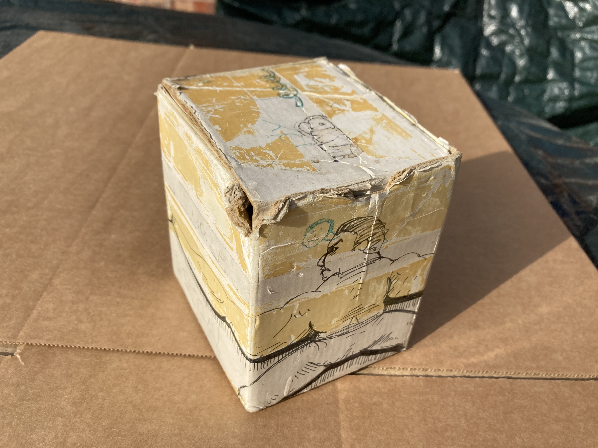
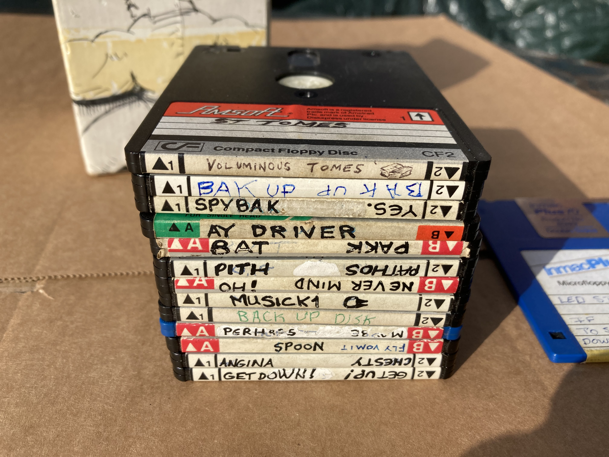
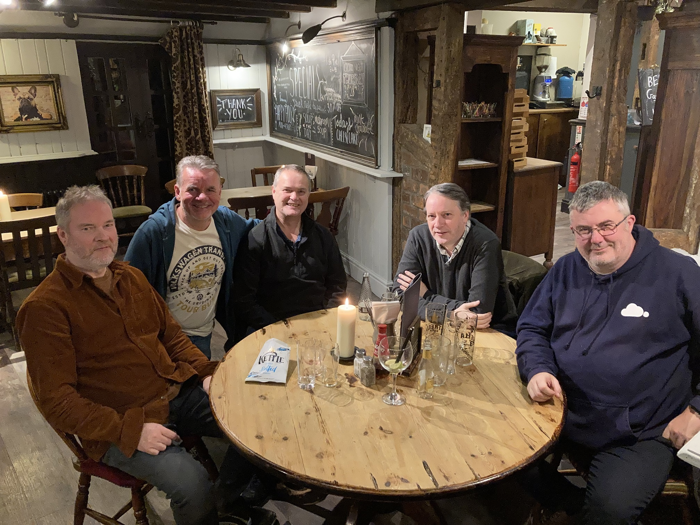

# Tim and Geoff Follin's Music Development Disk Archive

Tim and Geoff Follin's Music Development disks from their time at Software Creations, 1987 onwards.

Thirteen music development disks containing C64, ZX Spectrum and Amstrad CPC Music and SFX source files. Einstein format, 40 Track, double sided ( flippies ).

In addition to the music and sfx source files, there are several versions of the Music Driver ( player ) program for various target machines. These were written by Stephen Ruddy, who also coded many great C64 and console games - Bubble Bobble, Bionic Commando, LED Storm, Ghouls 'n Ghosts etc.

The disks contain music and sfx for various games / computers, including:-

* Bionic Commando
* Peter Pack Rat
* LED Storm
* Ghouls 'n Ghosts
* Aigina's Prophecy
* Chesterfield
* Black Lamp
* Raw Recruit
* AgentX II
* Puzznik

However, sometimes the reference name in the source code doesn't reflect the actual music within it - you have been warned!

There is a mixture of final, work-in-progress and possibly some unreleased/unfinished material. Some may be incomplete or differ from the final versions. I'm not familiar enough with the original pieces to sort them correctly. I'll leave that for others to investigate!

# Geoff Follin

Sadly, in May 2024, we lost Geoff Follin after a short battle with Pancreatic and liver Cancer. I am dedicating this archive to the memory of Geoff. I will always remember him as the wonderful, kind, helpful person that he was. We recently met up a couple of times, just a few months before he passed away. No one knew of his illness which cruelly took him from us so quickly.

(Photo - Left to Right ) Mike Follin, Myself, Geoff Follin, Tim Follin and Dean Belfield. Software Creations gathering, October 2023.

# A bit of history

Myself, Dean Belfield, Mike, Tim and Geoff Follin worked together at Software Creations in Manchester during the late 1980s/early 1990s. Creations was an amazing company with many wonderful, talented people. We worked in tiny, scruffy offices in central Manchester. However, the offices weren't important, it was all about having fun making videogames with some great people and earning a bit of money too.

Tim Follin, and his brother Geoff, developed music and sound effects at Software Creations. They worked on many games for various platforms including the Sinclair ZX Spectrum, Commodore 64, Nintendo Gameboy, Commodore Amiga, Atari ST, Nintendo NES and Nintendo SNES.

At Software Creations we used Tatung Einsteins as host development machines for our early 8-bit home computer games. They were connected to the target machines ( Spectrum, C64 etc. ) via parallel or serial links. The Einstein ran a very simple IDE ( Editor / Assembler ) that supported multiple CPU types ( Z80, 6502.. ). The Einstein is where all of the development work took place and the assembled code was deployed to the target machine where it would be executed and tested. The Einstein was a great workhorse as it had lots of memory, a decent keyboard, a fast disk system and it was cheap to buy compared with PCs or other similar systems. You could iterate code/data changes very quickly because of this workflow.

The programmers and musicians all used the Einstein to develop their code / music. These were later replaced with Commodore C128s briefly and then IBM PCs which were much faster and had greater memory/disk storage.

The process Tim and Geoff used to create music did not involve any instruments or sequencing software of any kind. Instead they manually typed in numbers for the musical notes and effects they wanted to play. A music driver ( player ) would interpret these numbers ( notes or commands ) and play them live whilst the game was running. This workflow seems crazy today, but at that time, many of the UK music developers worked in a similar way.

Each day everyone would take their work disks home and bring them back in the next morning to carry on with their work. We didn't have networks or cloud storage to backup our files! Because we were responsible for keeping our work safe, it also meant we had boxes of disks that went everywhere with us. We need to thank Tim for keeping hold of these disks for the last 35+ years rather than dumping them in the bin. They are an important piece of history that allows us to see exactly how music was developed all those years ago.

# Archiving the disks

A few years ago, Tim passed his box of Tatung Einstein 3" disks to Dean Belfield ( @BreakIntoProg ), a fellow Software Creations programmer and close friend, to see if he could recover the data off them. These contained the music and sfx source code for many titles that Tim and Geoff had worked on for the Spectrum and Commodore 64. Fortunately, a lot of the data was still in good shape and Dean was able to archive the disks directly on his working Tatung Einstein by reading / transferring the files, one by one. With Tim's blessing, he published his mostly complete archive here:-

https://github.com/breakintoprogram/archive-follin

Unfortunately, almost half of the disks had errors on them, some were worse than others. Typically, there were between 2 and 10 faulty sectors per disk. If a file on the disk mapped to one of these faulty sectors then the file would be corrupt part way through. As each disk sector is 512 bytes in length, this would result in as much as 512 bytes of damaged data per bad sector. If a file mapped to 2 or more sectors then it would have multiple corrupt blocks.

Using his Einstein, Dean was able to recover individual files that were 100% error free. However, if they had damaged sectors in them then the entire file was lost using this technique.

# Archiving the disks - part 2

Last year, Dean passed Tim's disk box to me so I could do a 2nd pass on them using some custom hardware/software to try and recover more data. I began the archiving process from scratch again. Multiple read re-tries allowed me to recover quite a few more files. Using various techniques I have been able to make the archive more complete. OK, some of the files have corrupt sections, but you can still see much of the previously missing/lost data!

I have also taken the opportunity to add new files to the archive to allow the disk images to be loaded on emulators - **.dsk** images. The full 'raw' disk track/sector image **.img** files are also present, these include every sector on the disk and may reveal un-discovered pieces of code that are no longer mapped to files in the archive, eg. old, deleted files. I took photos of each disk ( both sides and the edge ) and added them too. Tim quite often doodled or drew interesting images onto the disk labels which haven't been seen before.

# Disk archive description / organisation

The root of the repository contains two main folders, each containing multiple disk images.

**_Best_Faulty_Recovered**
 The disks in this folder have one or more bad sectors so some corruption exists within the file contents.

**_Fully_Recovered**
 The disk images, and their files, within this folder are 100% completed, without any errors.

If you browse inside either of the two main folders you will find sub-folders - one for each physical disk.

The disk folders use the following naming convention:-
- Two characters, followed by a description corresponding to what was written on the edge of the disk's label ( spine ). eg. **06 MUSICK1**
- If the first two characters are both numerical digits then these correspond to the same disk numbering system Dean used in his archive for cross-referencing.
- If the first character is a **K** then it's a new disk image that doesn't exist in the original archive. The 2nd digit is the new disk number.

Now go into one of the **disk** folders and you will find the following:-

- Several .JPGs - these are photos of the original disk.

- Two more folders - one for each side of the disk ( SIDE A and SIDE B ).
       Eg. 
       **A LMBL** is SIDE A's contents and
       **B CREAM CRACKER** has the contents of SIDE B.

Within each **disk side** folder you will find the following:-

- **.dsk** file - this file can be loaded/mounted and used with an Einstein Emulator
- **.img** file - this contains the imaged tracks/sectors from the disk.

- **EXPORTED_FILES** folder - this contains the individual files from the disk. Optionally, there may be Z80/6502 sub-folders to separate files for different processors/platforms.
                            

# Utilities and source file information

**EDIT.COM / TED65.COM** - the Einstein Editor / Assembler. This is the simple IDE program where everything takes place. It was written by Mike Webb, the creator of the Einstein development system hardware and software. This is where you load, edit, assemble the source code. With the development hardware present you can also deploy to the target machine ( C64 / Spectrum ). There are Z80 and 6502 versions of the IDE, TED65 is the tokenised 6502 version, the others can be 6502 or Z80. However, as a general rule, the editor and tokenised source on each disk match one another!

Source code for 6502 ( C64 ) and Z80 ( Spectrum/ Amstrad CPC ) is present on the disks.

To save a few bytes, most of the source code was stored in tokenised form - this was important on machines with limited memory and it also helped reduced the code assembly times. Therefore, the original files on the disk cannot be loaded into a standard text editor to view them. Byte values $80-$FE are used for the processor mnemonics and assembler directives/commands. However, there are Python programs present to de-tokenise files into plain ASCII so that they can be viewed easily. There are two versions, one to handle 6502 tokenisation and the other for Z80.

I have already de-tokenised many of the files in the **EXPORTED_FILES** folder and stored them in the same folder as the tokenised ones. They have the additional extension **.TXT** added to them. For example **GAME.SRC** would be the tokenised version directly from the original disk and **GAME.SRC.TXT** would be a plain ASCII version ( de-tokenised ).

# General Notes

This source code was only designed to be assembled within the IDE program **EDIT.COM / TED65.COM** on an Einstein Computer. However, with a bit of manipulation/processing, I'm sure it will be possible to get this to build using modern day cross assemblers / IDEs such as Visual Code. The code generated could then be run using your preferred Emulator.

I have made no attempt to get the source code to build and it is provided on an 'as-is' basis, with no warranty or guarantees.

It is provided as reference material and cannot be used, in part or whole, for financial gain/benefit.

All pull requests will be respectfully declined.

I do not plan to maintain this code in the future. However, additions/changes may be made to help tidy up, expand or explain the archive in more detail.

# Credits and acknowledgements

Thank you to the following people for making this archive possible:-

* Tim and Geoff Follin for their amazing work creating the music that we all remember so well and allowing us to archive their disks and make them available to all.

* Tim for keeping hold of these disks for so long!

* Stephen Ruddy for allowing us to share the music driver code ( SID, AY / Spectrum ) that he developed at Software Creations.

* Mike Follin for doing amazing things on the Spectrum and Amstrad.

* Dean Belfield for obtaining the disks, archiving them originally and allowing me to continue the archiving process.

* Mike Webb ( TD of Software Creations ) for creating the Einstein development system which made all of this possible!

* Richard Kay ( MD of Software Creations ) for getting us all together and giving us the opportunity to make great games.

* Damien Guard for helping me extract and understand some of the more troublesome disk images.

Thank you for reading. I hope you enjoy the archive!

Kevin Edwards, October 2024.
